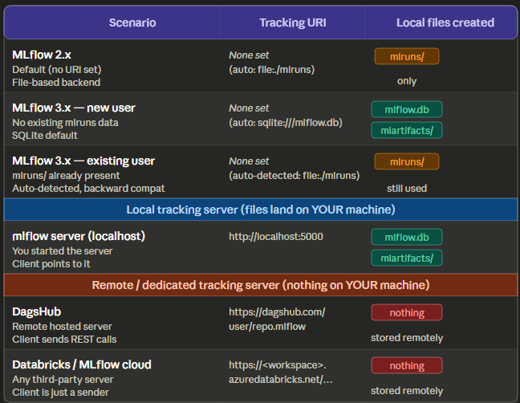
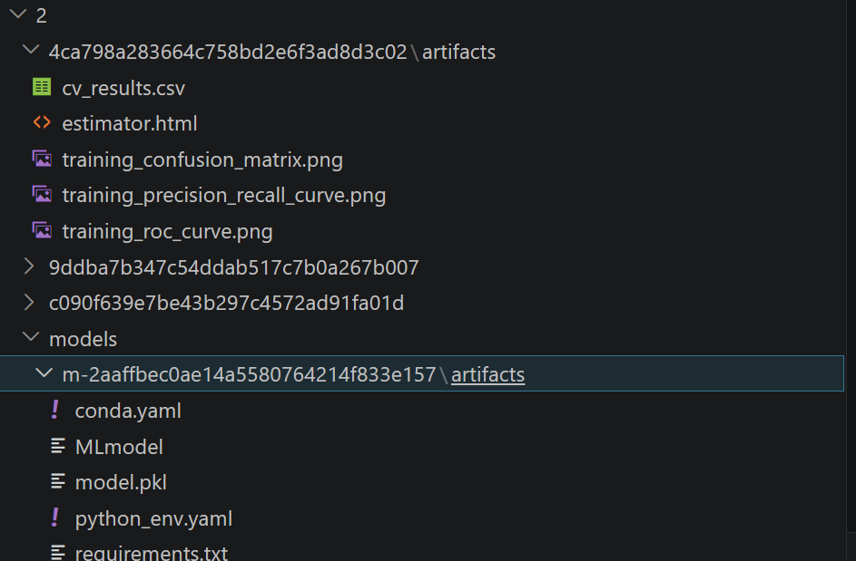
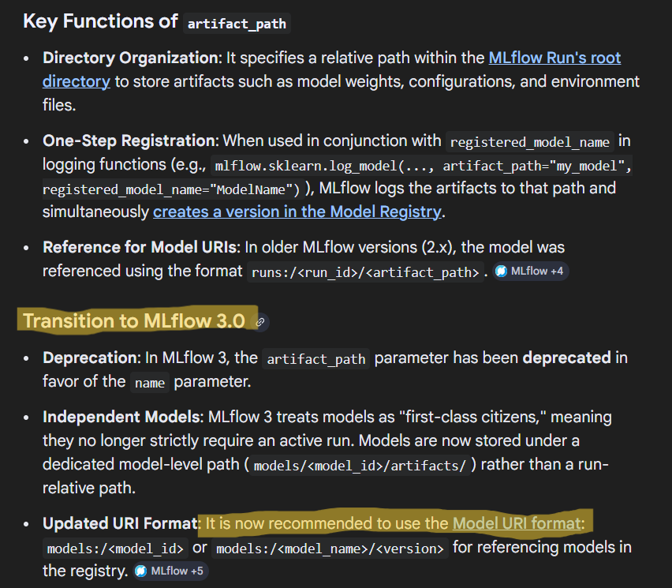

This Repo will help Avanindra to learn about mlflow basics that knwledge will be used for making production grade projects.

# Nuances of MLFlow Tracking Server

# ML artifacts folder structure
This structure has significantly changed

# Importnat Point to note about MLFlow 3.xx

